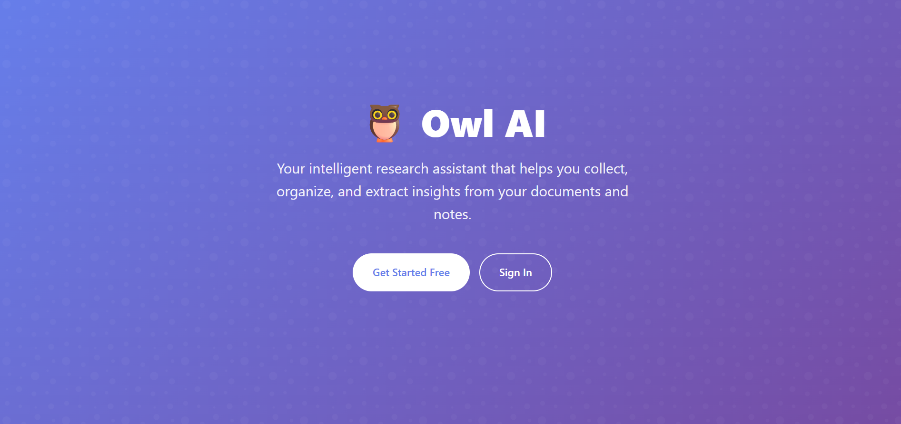
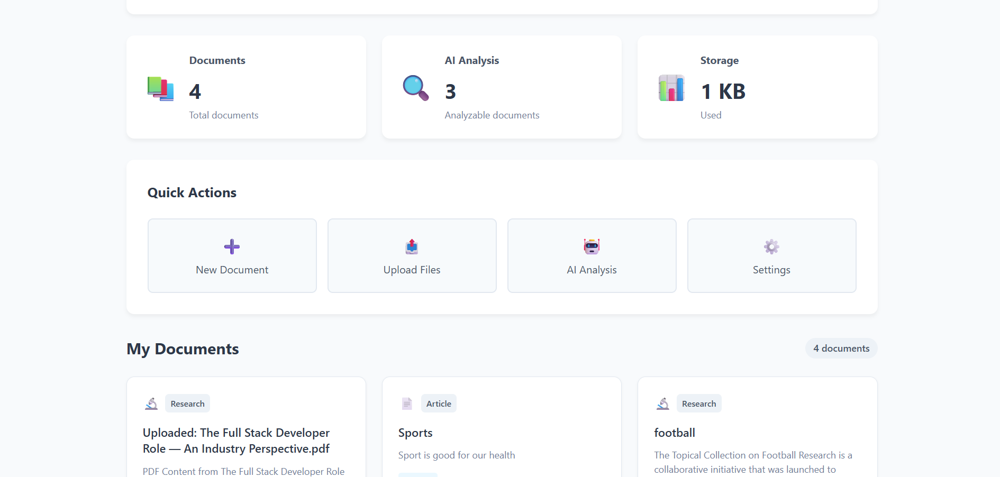
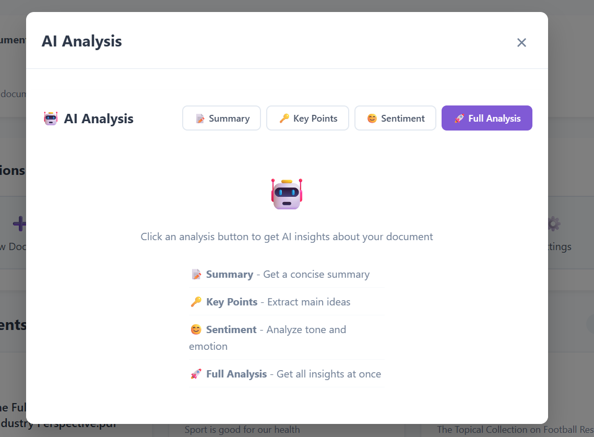

# Owl AI 🦉

[]()
[]()
[]()
[]()
[]()
[]()

---

## 🦉 Overview
Owl AI is an intelligent research assistant designed to help researchers, students, and knowledge workers collect, organize, and extract valuable insights from their documents and notes. With AI-powered features, Owl AI transforms how you manage and analyze your research materials.

---

## ✨ Features

### 🏠 Home & Authentication
- **Modern Landing Page** – Engaging introduction  
- **User Authentication** – Secure login/registration  
- **Get Started Free** – Easy onboarding  

### 📊 Dashboard & Document Management
- Smart document organization  
- AI-powered automatic categorization  
- Quick actions: create docs, upload files, access analysis, settings  

### 🔍 Advanced Search & Analysis
- Semantic search  
- AI insights: summaries, key points, sentiment, full analysis  

### 📁 Document Organization
- Categorized storage (Research, Articles, etc.)  
- File type support including PDFs  
- Upload timestamps and structured previews  

---

## 🖼️ Screenshots

### Landing Page


### Dashboard


### AI Analysis


---

## 🛠️ Technology Stack

**Frontend**
- Vite, React 18+, HTML5, CSS3, JavaScript ES6+  

**Backend**
- Node.js, Express.js, MongoDB, Mongoose  

**Deployment & Hosting**
- Render (Backend), Vercel (Frontend)  

---

## 🚀 Getting Started

### Prerequisites
- Node.js v16+  
- MongoDB  
- npm or yarn  

### Installation
```bash
git clone https://github.com/your-username/owl-ai.git
cd owl-ai

# Backend
cd backend
npm install

# Frontend
cd ../frontend
npm install

#Environment Setup
Create .env in backend:
MONGODB_URI=your_mongodb_connection_string
PORT=5000

Run the application

# Backend
cd backend
npm run dev

# Frontend
cd ../frontend
npm run dev

Frontend: http://localhost:3000

Backend API: http://localhost:5000

---

🌐 Deployment

Frontend (Vercel)

npm run build
vercel --prod

Backend (Render)

Connect GitHub repo to Render

Set environment variables

Auto-deploy on push to main branch

---

🤝 Contributing

We welcome contributions! Submit pull requests or open issues for bugs and feature requests.

---

📄 License

MIT License – see LICENSE file for details.

---

🆘 Support

Open a GitHub issue

Check documentation

Contact support team

---

Owl AI – Making research smarter, one document at a time. 🦉
